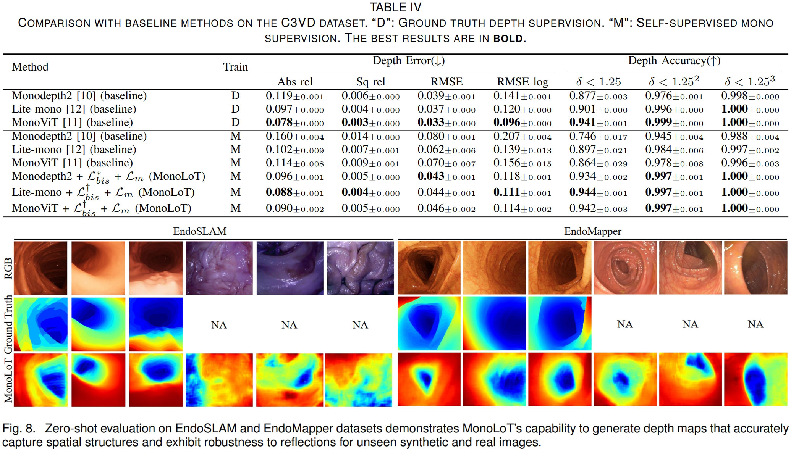

# [JBHI'24] MonoLoT
Official Pytorch implementation of **MonoLoT: Self-Supervised Monocular Depth Estimation in Low-Texture Scenes for Automatic Robotic Endoscopy**.

[Qi HE](https://howardchina.github.io), 
Guang Feng, 
[Sophia Bano](https://sophiabano.github.io/),
[Danail Stoyanov](https://profiles.ucl.ac.uk/32290),
[Siyang Zuo](https://scholar.google.co.uk/citations?user=FPFY0CgAAAAJ&hl=en)

 [[`IEEExplore`](https://ieeexplore.ieee.org/document/10587075)][[`YouTube`](https://youtu.be/7mAyTpjI13Q?si=JvnwjsjJyxkJ7LiD)] [[`Github`](https://github.com/howardchina/MonoLoT)][[`PDF in Google Drive`](https://drive.google.com/file/d/12DyEv0R_qfWXiO7U9K04PKGjAxE6sLnw/view?usp=sharing)]


## Overview
<p align="left">

</p>

Our research has introduced an innovative approach that addresses the challenges associated with self-supervised monocular depth estimation in digestive endoscopy. We have addressed two critical aspects: the limitations of self-supervised depth estimation in low-texture scenes and the application of
depth estimation in visual servoing for digestive endoscopy.
Our investigation has revealed that the struggles of self-supervised depth estimation in low-texture scenes stem from inaccurate photometric reconstruction losses. To overcome this, we have introduced the point-matching loss, which refines the reprojected points. Furthermore, during the training process, data augmentation is achieved through batch image shuffle loss, significantly improving the accuracy and generalisation capability of the depth model. The combined contributions of the point matching loss and batch image shuffle loss have boosted the baseline accuracy by a minimum of 5% on both the C3VD and SimCol datasets, surpassing the generalisability of ground truth depth-supervised baselines when applied to upper-GI datasets. Moreover, the successful implementation of our robotic platform for automatic intervention in digestive endoscopy demonstrates the practical and impactful application of monocular depth estimation technology.


## Performance

<p align="left">

</p>


## Installation

We tested our code on a server with Ubuntu 18.04.6, cuda 11.1, gcc 7.5.0
1. Clone project
```
$ git clone https://github.com/howardchina/MonoLoT.git
$ cd MonoLoT
```
2. Install environment
```
$ conda create --name monolot --file requirements.txt
$ conda activate monolot
```

## Data

First, create a ```data/``` folder inside the project path by 
```
$ mkdir data
```

The data structure will be organised as follows:

```
$ tree data
data
├── c3vd_v2
│   ├── imgs -> <c3vd_v2_img_dir>
│   └── matcher_results
│       ├── test.npy
│       ├── train.npy
│       └── val.npy
└── simcol_complete
    ├── imgs -> <simcol_img_dir>
    └── matcher_results
        ├── test_352x352.npy
        ├── train_352x352.npy
        └── val_352x352.npy
...
```

Second, some image preprocessings are necessery such as undistort, filter static frames, and data split.

Take ```c3vd_v2``` for instance, the following script should be processing:

- undistort frames: ```playground\heqi\C3VD\data_preprocessing.ipynb```
- (optional) filter static frames and data split by yourself: ```playground\heqi\C3VD\gen_split.ipynb```
- (optional) generate ```matcher_results``` by yourself: ```playground\heqi\C3VD\gen_corres.ipynb```

(optimal) Similar image preprocessings should be applied to ```simcol_complete``` as well, check ```playground\heqi\Simcol_complete```.


We provide two ways for generating matching results saved in ```matcher_results``` folders.

- (recommend) download ```matcher_results``` of ```c3vd_v2``` and ```simcol_complete``` from [here](https://www.jianguoyun.com/p/DVrMNkgQy4rfDBjWtc0FIAA)
- (not recommend) generate the ```matcher_results``` by yourself using notebooks mentioned above such as ```playground\heqi\C3VD\gen_corres.ipynb```. As this process will take about 2-4 hours.

Soft link (```->```) the well-prepared image folders to this workspace.
 
The image folder of c3vd_v2 (<c3vd_v2_img_dir>) will be organised as follows:

```
$ cd c3vd_v2
$ tree imgs
imgs
├── cecum_t1_a_under_review
│   ├── 0000_color.png
│   ├── 0000_depth.tiff
│   ├── 0001_color.png
│   ├── 0001_depth.tiff
│   ├── 0002_color.png
│   ├── 0002_depth.tiff
│   ├── 0003_color.png
│   ├── 0003_depth.tiff
│   ├── 0004_color.png
│   ├── 0004_depth.tiff
│   ├── ...
├── cecum_t1_b_under_review
│   ├── ...
├── cecum_t2_a_under_review
├── cecum_t2_b_under_review
├── cecum_t2_c_under_review
├── cecum_t3_a_under_review
├── cecum_t4_a_under_review
├── cecum_t4_b_under_review
├── desc_t4_a_under_review
├── sigmoid_t1_a_under_review
├── sigmoid_t2_a_under_review
├── sigmoid_t3_a_under_review
├── sigmoid_t3_b_under_review
├── trans_t1_a_under_review
├── trans_t1_b_under_review
├── trans_t2_a_under_review
├── trans_t2_b_under_review
├── trans_t2_c_under_review
├── trans_t3_a_under_review
├── trans_t3_b_under_review
├── trans_t4_a_under_review
└── trans_t4_b_under_review
```

The image folder of simcol_complete (<simcol_img_dir>) will be organised as follows:

```
$ cd ..
$ cd simcol_complete
$ tree imgs
imgs
├── SyntheticColon_I
│   ├── Test_labels
│   │   ├── Frames_S10
│   │   │   ├── Depth_0000.png
│   │   │   ├── Depth_0001.png
│   │   │   ├── Depth_0002.png
│   │   │   ├── Depth_0003.png
│   │   │   ├── Depth_0004.png
│   │   │   ├── Depth_0005.png
│   │   │   ...
│   │   │   ├── Depth_1200.png
│   │   │   ├── FrameBuffer_0000.png
│   │   │   ├── FrameBuffer_0001.png
│   │   │   ├── FrameBuffer_0002.png
│   │   │   ├── FrameBuffer_0003.png
│   │   │   ├── FrameBuffer_0004.png
│   │   │   ├── FrameBuffer_0005.png
│   │   │   ...
│   │   │   └── FrameBuffer_1200.png
│   │   ├── Frames_S15
│   │   └── Frames_S5
│   ├── Train
│   │   ├── Frames_S1
│   │   ├── Frames_S11
│   │   ├── Frames_S12
│   │   ├── Frames_S13
│   │   ├── Frames_S2
│   │   ├── Frames_S3
│   │   ├── Frames_S6
│   │   ├── Frames_S7
│   │   └── Frames_S8
│   └── Val
│       ├── Frames_S14
│       ├── Frames_S4
│       └── Frames_S9
├── SyntheticColon_II
│   ├── Test_labels
│   │   ├── Frames_B10
│   │   ├── Frames_B15
│   │   └── Frames_B5
│   ├── Train
│   │   ├── Frames_B1
│   │   ├── Frames_B11
│   │   ├── Frames_B12
│   │   ├── Frames_B13
│   │   ├── Frames_B2
│   │   ├── Frames_B3
│   │   ├── Frames_B6
│   │   ├── Frames_B7
│   │   └── Frames_B8
│   └── Val
│       ├── Frames_B14
│       ├── Frames_B4
│       └── Frames_B9
└── SyntheticColon_III
    ├── Test_labels
    │   ├── Frames_O1
    │   ├── Frames_O2
    │   └── Frames_O3
    └── Train
```


### Public Data

For both training and inference:
 - The **C3VD** dataset is available in its [Homepage](https://durrlab.github.io/C3VD/). 
 - The **SimCol** dataset is available in [rdr.ucl](https://rdr.ucl.ac.uk/articles/dataset/Simcol3D_-_3D_Reconstruction_during_Colonoscopy_Challenge_Dataset/24077763). 

For inference only:
 - The **UpperGI** dataset is available in [Jianguoyun](https://www.jianguoyun.com/p/DRoZPfUQzsq_Cxj23qIFIAA).
 - The **EndoSLAM** dataset is available in [Mendeley](https://data.mendeley.com/datasets/cd2rtzm23r/1). 
 - The **EndoMapper** dataset is available in [Synapse](https://www.synapse.org/Synapse:syn26707219/files/). 


## Training

To train scenes, we provide the following training scripts: 


**Table IV: train and test on C3VD**
|                                                                  |   |   |
|------------------------------------------------------------------|---|---|
| Monodepth2 (baseline)                                            | D | ```supervised_c3vd_v2_monodepth2.yml```  |
| Lite-mono (baseline)                                             | D | ```supervised_c3vd_v2_litemono.yml```  |
| MonoViT (baseline)                                               | D | ```supervised_c3vd_v2_monovit.yml```  |
| Monodepth2 (baseline)                                            | M | ```baseline_c3vd_v2_monodepth2.yml```  |
| Lite-mono (baseline)                                             | M | ```baseline_c3vd_v2_litemono.yml```  |
| MonoViT (baseline)                                               | M | ```baseline_c3vd_v2_monovit.yml```  |
| Monodepth2 + $\mathcal{L}_{bis}^*$ + $\mathcal{L}_m$ (MonoLoT)   | M | ```RCC_matching_cropalign_c3vd_v2_monodepth2.yml```  |
| Lite-mono + $\mathcal{L}_{bis}^+$ + $\mathcal{L}_m$ (MonoLoT) | M | ```RC_matching_c3vd_v2_litemono.yml```  |
| MonoViT + $\mathcal{L}_{bis}^+$ + $\mathcal{L}_m$ (MonoLoT)   | M | ```RC_matching_c3vd_v2_monovit.yml```  |


**Table V: train and test on SimCol**
|                                                                  |   |   |
|------------------------------------------------------------------|---|---|
| Monodepth2 (baseline)                                            | D | ```supervised_simcol_complete_monodepth2.yml```  |
| Lite-mono (baseline)                                             | D | ```supervised_simcol_complete_litemono.yml```  |
| MonoViT (baseline)                                               | D | ```supervised_simcol_complete_monovit.yml```  |
| Monodepth2 (baseline)                                            | M | ```baseline_simcol_complete_monodepth2.yml```  |
| Lite-mono (baseline)                                             | M | ```baseline_simcol_complete_litemono.yml```  |
| MonoViT (baseline)                                               | M | ```baseline_simcol_complete_monovit.yml```  |
| Monodepth2 + $\mathcal{L}_{bis}^*$ + $\mathcal{L}_m$ (MonoLoT)   | M | ```RCC_cropalign_matching_simcol_complete_monodepth2.yml```  |
| Lite-mono + $\mathcal{L}_{bis}^*$ + $\mathcal{L}_m$ (MonoLoT) | M | ```RCC_cropalign_matching_simcol_complete_litemono.yml```  |
| MonoViT + $\mathcal{L}_{bis}^+$ + $\mathcal{L}_m$ (MonoLoT)   | M | ```RC_matching_simcol_complete_monovit.yml```  |


**Table VI: ablation study on C3VD**


    
 

 run them with 
 ```
 CUDA_VISIBLE_DEVICES=0 python run.py --config experiments/<file_name>.yml --cfg_params '{"model_name": "<exp_name>"}' --seed 1243 --gpu 0 --num_workers 4
 ```

The code will automatically run the entire process of: **training, encoding, decoding, testing**.
 - Training log will be recorded in `output.log` of the output directory. Results of **detailed fidelity, detailed size, detailed time** will all be recorded
 - Encoded bitstreams will be stored in `./bitstreams` of the output directory.
 - Evaluated output images will be saved in `./test/ours_30000/renders` of the output directory.
 - Optionally, you can change `lmbda` in these `run_shell_xxx.py` scripts to try variable bitrate.
 - **After training, the original model `point_cloud.ply` is losslessly compressed as `./bitstreams`. You should refer to `./bitstreams` to get the final model size, but not `point_cloud.ply`. You can even delete `point_cloud.ply` if you like :).**


## Contact

- Qi HE: howard@tju.edu.cn

## Citation

If you find our work helpful, please consider citing:

```bibtex
@ARTICLE{10587075,
  author={He, Qi and Feng, Guang and Bano, Sophia and Stoyanov, Danail and Zuo, Siyang},
  journal={IEEE Journal of Biomedical and Health Informatics}, 
  title={MonoLoT: Self-Supervised Monocular Depth Estimation in Low-Texture Scenes for Automatic Robotic Endoscopy}, 
  year={2024},
  pages={1-14},
  keywords={Estimation;Endoscopes;Training;Data models;Robots;Feature extraction;Image reconstruction;Monocular depth estimation;automatic intervention;digestive endoscopy},
  doi={10.1109/JBHI.2024.3423791}}
```


## LICENSE

<div class="row" style="margin: 0px;">
            <div class="col text-center" style="margin: 0px;padding: 0px;margin-top: 40px;"><p xmlns:cc="http://creativecommons.org/ns#" >This work is licensed under <a href="http://creativecommons.org/licenses/by-nc-sa/4.0/?ref=chooser-v1" target="_blank" rel="license noopener noreferrer" style="display:inline-block;">CC BY-NC-SA 4.0</a></p></div>
        </div>

## Acknowledgement

 - We thank all authors from [C3VD](https://durrlab.github.io/C3VD/) for presenting such an excellent work.
 - We thank all authors from [SimCol3D](https://github.com/anitarau/simcol) for presenting such an excellent work.
 - We thank all authors from [EndoSLAM](https://github.com/CapsuleEndoscope/EndoSLAM) for presenting such an excellent work.
 - We thank all authors from [EndoMapper](https://sites.google.com/unizar.es/endomapper/home) for presenting such an excellent work.